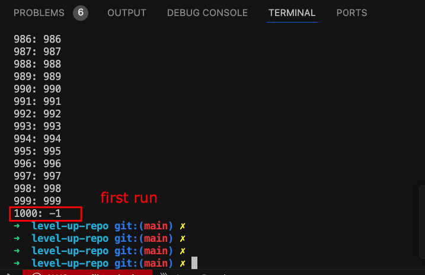
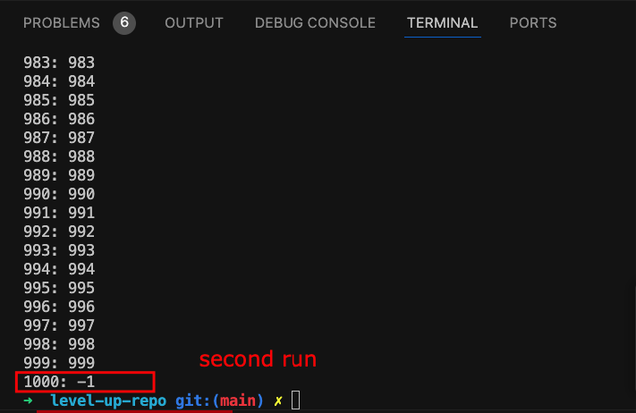
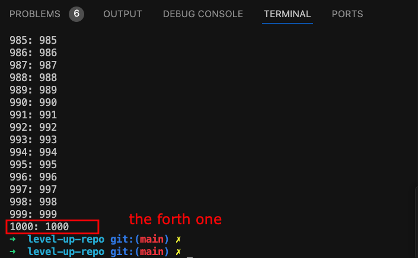

### Instroduction: 
- Create a hashmap with pattern like: (1,1); (2,2); (3,3); ... (length=1000)
- Create a Thread to read and print out from 1 -> 1000
- Create another Thread to modify: ```map.put(1000, -1)```

### Results:



...

### Conclusion
- According to the current state of the local CPU, the test may be happened differently.
    => debug difficultly

- Condition of confliction's happen:
    - Sharing resource: ```map```
    - At least 1 Thread tries to modify the ```map```

### Terms
- Heap vs Stacl:
    - Heap: 
        - Objects or data
        - Slower to access compared to the stack.
    - Stack: : 
        - Local variables, function calls, and control flow.
        - Storing function call details like return addresses, local variables, and function arguments.

- Parameter vs Argument:
    - Parameter: the placeholder 
        ```
        def greet(name):  # `name` is a parameter.
            print(f"Hello, {name}!")
        ```

    - Argument: the *actual* value
        ```
        greet("Alice")  # "Alice" is the argument.
        ```
